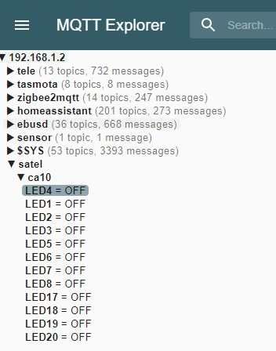
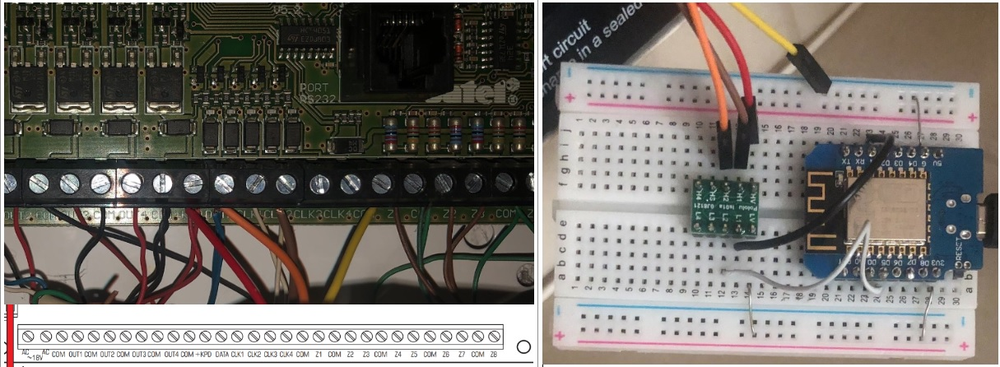
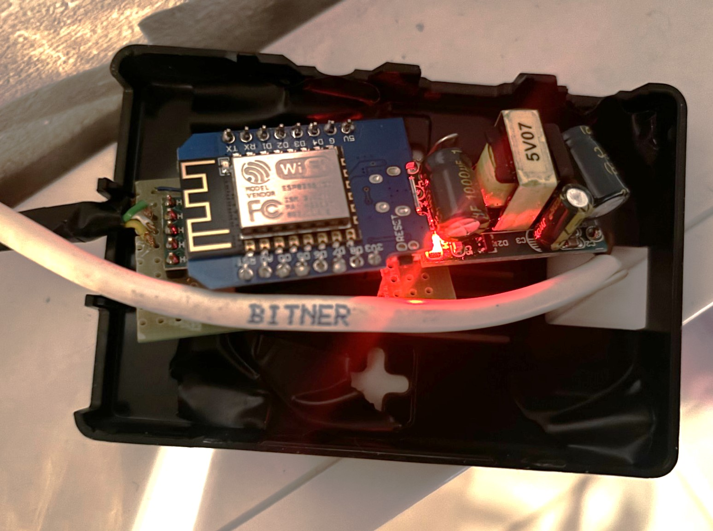
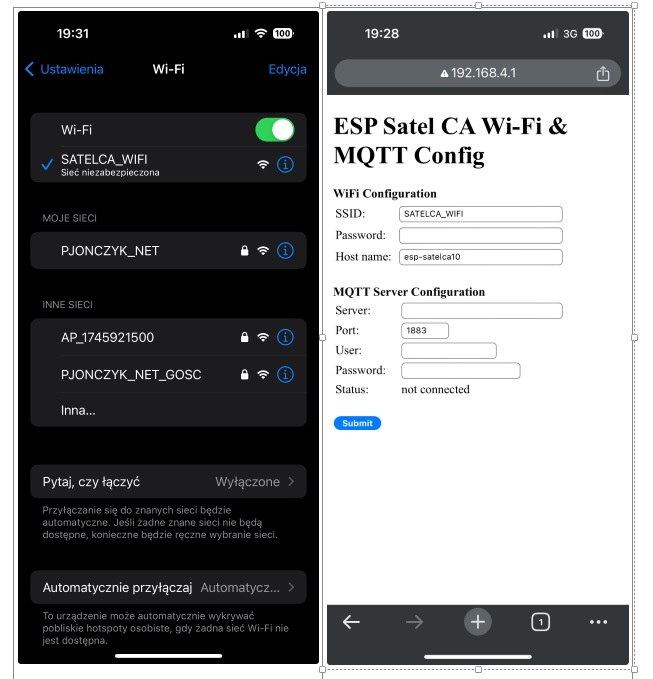
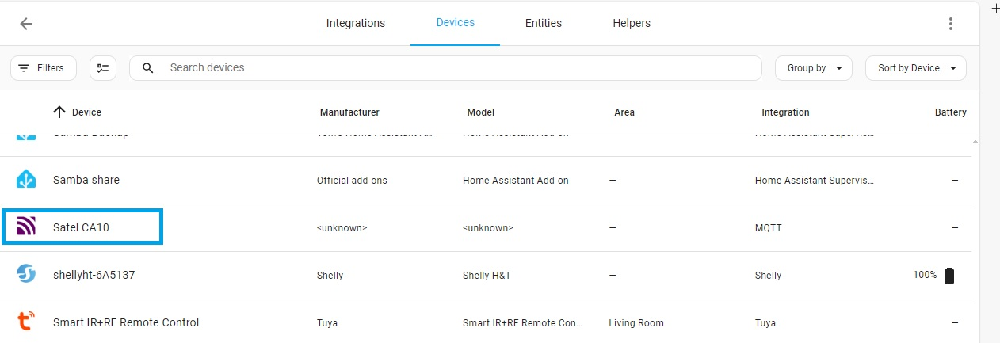
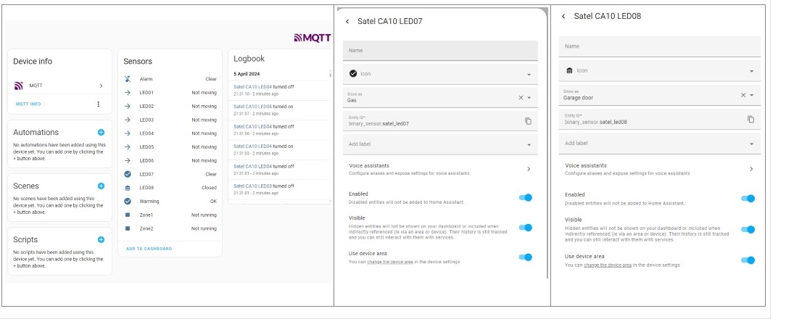

# SATEL CA10 to HomeAssistant over MQTT
This Visual Studio Code project includes firmware for an ESP 8266 board (not tested or compiled for other boards) to send data from Satel CA10 alarm unit using KLED keyboard signal and wires to HomeAssistant. Most probably it will work with Satel CA6 too.

Main idea has been taken from [GSzabados project](https://github.com/GSzabados/SATEL_CA-6_to_MQTT) (GREAT thanks), after several apporaches with connecting over the CA10 printer serial port e.g. [project](https://github.com/voyo/satel2mqtt).

Additionally comparing to Szabados code includes: 
- ESP 8266 adjustments
- WiFi/MQTT Server Connection Configuration with HTML page - you don't need to hard code the passwords, servers, etc.
- HomeAssistant Device Discovery - SATEL CA 10 device appear immediately in your HA device list with all sensors inside, not needed to define anything in configuration.yaml
- Mapping of Satel frame bits into HA binary sensor with default device class
- sending only the changes not the whole frame every time (it reduce mqtt server overload and traffic)
- Additional code to trace changed bit sent to central alarm unit (It can be useful to find more leds/sensors which were not find by me).
- More flexibility to extend frame e.g. for other Satal alarm system if the data frame might be longer than 32bits and is not encrypted. If there is a volunteer to check with other Satel central unit I can better explain.

## Background:
See more details [here](https://github.com/GSzabados/SATEL_CA-6_to_MQTT). Szabados explained it quite well with different keypad. I use KLED for Satel CA10 alarm system.

The Satel keypad has a 4 wire connection to central alarm unit that includes

  **+KPD**: +12V    
  **COM**: Ground     
  **CLK**: Clock Signal     
  **DATA**: Data Signal  

The alarm unit communicates with the keypad by a clock synced data signal. The clock has a frequency of 2kHz, and runs for 16 periods together with the data signal, giving 32bits of data in one frame. 

This 32bits is decoded by the ESP and transmitted to MQTT broker under satel/ca10/ topic with separate topic for each LED displayed on the keyboard (LED1 - LED8, LED17-LED20). The message is send only when value of any Satel sensor is changed and send the state of all sensor every 3 min. I left LED9-LED16 for Satel sensors, I'm not able to test now.

Meanig of Satel frame bits:
  **31, 29, 27, 25, 15, 13, 11, 9** - represent led 1 to 8 on manipulator, 
  **19**                            - malfunction led bit, 
  **21**                            - zone1 activate bit, 
  **17**                            - zone2 activate bit, 
  **23**                            - alarm LED bit.

HA discovery message is send every 3 min. under homeassistant/binary_sensor/satelca10/ mqtt topic and LED17-20 are set with following HA device class: problem, running, running, sound, which allows to dispal proper icon in HA by default.

## Step 1 - build the adapter board to connect Satel to ESP (this is not so difficult as you think :) ) 
Due to the 12V power supply of the Satel alarm unit, the CLK and DATA lines also use 12V signal. This 12V signal first have to be converted to 3.3V or 5V before connecting to ESP board. 
Please use [Pololu 2595](https://www.pololu.com/product/2595) or anything similar. It accepts  18 V on the higher-voltage side.
The **+KPD** has to be connected to its HV input, **CLK** and **DATA** to any of the inputs on the HV side of the module (H1-H4).

On the low voltage side of the module LV should be connected to the 3.3V or 5V power input of the ESP module and the respective L1-L4 should be connected to two GPIO pins of the ESP. Pease use following ESP pins: DATA PIN D5, Clock PIN D1, COM should be connected to the GND of the ESP.

See this prototype board connected to the computer USB port below: 

Additionally, I preferred to use 220V->5V [power step down module](https://pl.aliexpress.com/item/32657634893.html?spm=a2g0o.order_list.order_list_main.120.7cb21c24SDTcQD&gatewayAdapt=glo2pol) for ESP power supply in the final version of the whole board. Please find the final version of the adapter

## Step 2 - compile the source code and upload firmware to your ESP board
Please use Visual Studio Code (VSC) and PlatfromIO add-in to compile the code and upload the firmware to your ESP. There is a lot of messages send to VSC terminal (via Serial.print command) during the run. You can trace all messages or use it for debug mode in case of any issues or when trying to find new sensors which were not find be me.

## Step 3 - configure WiFi and MQTT
Once firmware is uploaded and ESP is run, you need to connect to ESP WiFI default Access Point (SATEL_WIFI) to configure your WiFi network and your HA MQTT Server. Please see pictures bellow

If you give wrong WiFi network parameters (SSID or password) then you will have to wait 150 sec. to enter ESP in AP mode. If WiFi network parameters are good ESP will start sending MQTT messages and you will be able to find SATLE CA10 in your HA devices (you might way max 3 min for device discovery).

If Satele CA10 is not visible, please try to identify what IP address was assigned to your ESP and connect to it with the browres to check if MQTT server is connected.

## Step 4 - adjusting class device in HA for specific sensors
I have gas sensor on LED7 and reed relay for garage door. In these case I had to change device class for this 2 LEDS in HA.

## My Summary
Connecting all sensor for Satel alarm unit added a lot of functionality to my HA. Now I know the status of my garage door, I can send messages if they are open during the night,, I can switch off devices if no one is in the room for a longer time, etc.

Have a fun.